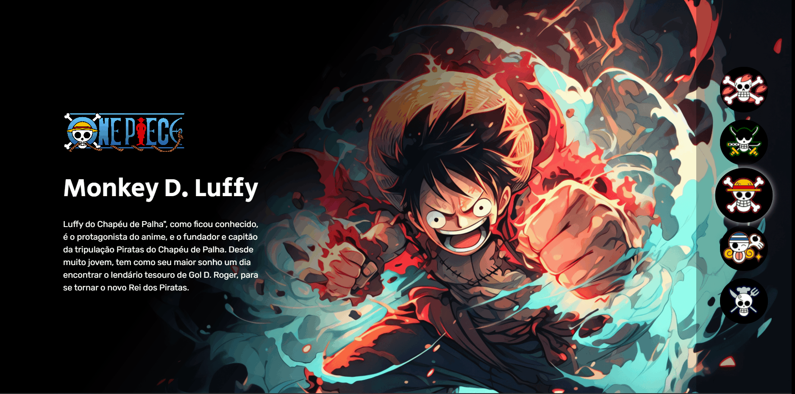

## One Piece Application

<ul>
    <li><a href="#screenshot🖥️">Screenshot</a></li>
    <li><a href="#about📝">About</a></li>
    <li><a href="#how-to-use⌨️">How to use</a></li>
    <li><a href="#technologies🖲️">Technologies</a></li>
</ul>

## Screenshot🖥️




## About📝
Project to develop a website to show a image and infos of the caracter choosen by the user 

### Technologies🖲️
Build with:
- Javascript
- HTML
- CSS

## How to use⌨️
```sh 
git clone https://github.com/LuccaMontarroyos/Projeto-one-piece.git
```
open `index.html` in your web browser
